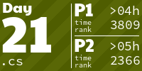
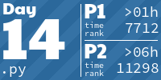

<!-- AOC TILES BEGIN -->
<h1 align="center">
  Advent of Code - 184/500 ⭐
</h1>
<h1 align="center">
  2024 - 50 ⭐ - Smalltalk
</h1>

<h1 align="center">
  2023 - 50 ⭐ - Python
</h1>

<h1 align="center">
  2022 - 50 ⭐ - Python
</h1>

<h1 align="center">
  2021 - 34 ⭐ - C++
</h1>

<!-- AOC TILES END -->
