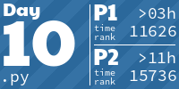
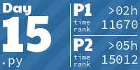
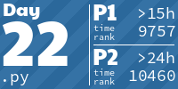
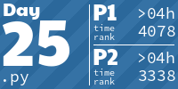

<!-- AOC TILES BEGIN -->
<h1 align="center">
  2023 - 50 ⭐
</h1>

<!-- AOC TILES END -->

# AdventOfCode 2023
My first AoC.
Python at least, if time allows it will try to solve challenge in C as well.
